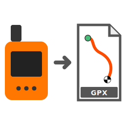

# InReach to Strava GPX Converter

Converts Garmin InReach CSV exports into daily GPX files for Strava upload.

## Features

- Filters invalid coordinates (empty or 0 values)
- Auto-detects timezone from GPS coordinates
- Splits tracks at 2am local time (handles overnight tracking)
- Generates one GPX file per day
- Ready for Strava upload

## Installation

```bash
pip install -r requirements.txt
```

## Getting Your InReach Data

To export your tracking data from Garmin:

1. Go to https://www.garmin.com/en-US/account/datamanagement/
2. Click "Export Your Data"
3. Click "REQUEST DATA EXPORT"
4. Wait for an email (typically within 48 hours, check spam/junk folders)
5. Download and unzip the file
6. The CSV you need is in `INREACH/message-history.csv`

**Note:** You can only request one export at a time. The export can take up to 30 days in some cases.

## Usage

```bash
# Basic usage (outputs to current directory, defaults to hiking)
python inreach_to_gpx.py your_inreach_export.csv

# Specify output directory
python inreach_to_gpx.py your_inreach_export.csv -o ./gpx_files

# Set activity type
python inreach_to_gpx.py your_inreach_export.csv --type biking

# Output as FIT format (better for Strava - preserves time/elevation)
python inreach_to_gpx.py your_inreach_export.csv --format fit

# Add interpolated points every 10 seconds for Strava compatibility
python inreach_to_gpx.py your_inreach_export.csv --interpolate 10

# Combine FIT format with interpolation (recommended for Strava)
python inreach_to_gpx.py your_inreach_export.csv --format fit --interpolate 10

# Match to route GPX for accurate distance/elevation
python inreach_to_gpx.py your_inreach_export.csv \
  --route-gpx trail_map.gpx \
  --format fit

# Multiple route files (main trail + side trails)
python inreach_to_gpx.py your_inreach_export.csv \
  --route-gpx main_trail.gpx \
  --route-gpx spur_trail.gpx \
  --format fit

# Output both GPX and FIT
python inreach_to_gpx.py your_inreach_export.csv --format both

# Filter out short tracks (rest days with GPS jitter)
python inreach_to_gpx.py your_inreach_export.csv --min-distance 2.0

# Process a specific trip by date range with a name
python inreach_to_gpx.py your_inreach_export.csv \
  --start-date 2024-03-15 --end-date 2024-03-20 \
  --name "PCT Section J" --type hiking --format fit -o ./pct_section_j

# Process multiple trips from the same CSV
python inreach_to_gpx.py data.csv \
  --start-date 2024-03-15 --end-date 2024-03-20 \
  --name "JMT" --type hiking --format fit -o ./jmt

python inreach_to_gpx.py data.csv \
  --start-date 2024-04-01 --end-date 2024-04-05 \
  --name "Tahoe Rim" --type biking --format fit -o ./tahoe

# Custom description
python inreach_to_gpx.py data.csv \
  --description "Backpacking trip with GPS tracking" \
  --name "My Adventure"

# All options together
python inreach_to_gpx.py your_inreach_export.csv \
  -o ./output -t hiking -m 0.5 -n "My Hike" \
  -d "Epic adventure in the mountains"
```

### Options

- `-o, --output-dir` - Directory for output GPX files (default: current directory)
- `-t, --type` - Activity type: `hiking`, `biking`, `running`, or `walking` (default: hiking)
- `-m, --min-distance` - Minimum distance in km to include a day (default: 1.0)
  - Filters out rest days where GPS jitter created spurious tracks
- `--start-date` - Start date for filtering, inclusive (YYYY-MM-DD format)
- `--end-date` - End date for filtering, inclusive (YYYY-MM-DD format)
- `-n, --name` - Trip name to include in GPX track names and metadata
- `-d, --description` - Description to include in GPX metadata (default: "Recorded by Garmin InReach")
- `-f, --format` - Output format: `gpx`, `fit`, or `both` (default: gpx)
  - FIT files work better with Strava (preserves time and elevation data)
  - GPX files are more universal and easier to view
- `--interpolate SECONDS` - Add interpolated points every N seconds (e.g., 10 for best Strava results)
  - Helps Strava calculate moving time correctly with sparse GPS data
  - Uses linear interpolation between actual GPS points
  - Recommended: 10 seconds for Strava compatibility
  - Only skips gaps >1 hour (overnight/long breaks)
- `--route-gpx FILE` - Route GPX file to match against (can specify multiple times)
  - Snaps your track to actual trail routes for accurate distance and elevation
  - Supports multiple GPX files for trail junctions and side trails
- `--route-tolerance METERS` - Maximum distance to snap to route (default: 200)
  - Increase for sparse route GPX files or less accurate GPS
- `--route-merge METERS` - Distance to merge route nodes/junctions (default: 10)
- `--max-route-ratio RATIO` - Max route_distance/linear_distance ratio (default: 3.0)
  - Prevents incorrect matching on parallel trails or switchbacks

This will create files named `track_YYYY-MM-DD.gpx` and/or `track_YYYY-MM-DD.fit` in the specified directory.

## CSV Format Expected

The script expects a CSV with these columns:
- `GPSTime` - Timestamp in UTC (e.g., "3/17/2024 5:52:00 PM")
- `Lat` - Latitude
- `Lon` - Longitude
- `AltitudeMeters` - Elevation in meters

## How It Works

1. **Filters bad data**: Skips rows with empty or 0 lat/lon
2. **Timezone detection**: Uses coordinates from first point of each UTC day to determine timezone (optimized for speed)
3. **Day splitting**: Groups points by day, with 2am local time as the cutoff
   - Points before 2am belong to the previous day
   - This handles overnight tracking and multi-day hikes
4. **GPX generation**: Creates standard GPX files with track, segment, and points

## Upload to Strava

1. Log into Strava
2. Click the "+" icon → "Upload Activity"
3. Select your GPX file(s)
4. Strava will auto-detect the activity type (usually "Hike")
5. Review and save

## Notes

- GPX files use UTC timestamps (as per GPX spec)
- InReach typically logs points every 10-20 minutes
- The script preserves all valid trackpoints including altitude
- All GPX files include "Recorded by Garmin InReach" in the description

### FIT vs GPX Format

**Use FIT format (`--format fit`) for Strava uploads:**
- FIT files properly encode elapsed time and moving time, avoiding Strava's "0s" duration issue
- FIT files preserve elevation data more reliably
- Strava processes FIT files better for sparse GPS data (10-20 minute intervals)

**Use GPX format for:**
- Viewing in mapping/GIS applications
- Maximum compatibility with other tools
- Human-readable XML format

### Interpolation

InReach devices typically log points every 10-20 minutes. This sparse data can cause issues with Strava:
- Moving time shows as "0s" because Strava thinks you teleported between points
- Distance may be underestimated due to straight-line connections

**Using `--interpolate 10`** adds points every 10 seconds via linear interpolation:
- Helps Strava calculate moving time correctly (60s intervals may still show as 0s)
- Provides smoother tracks and better distance estimates
- Note: Interpolated points follow straight lines, not actual terrain or trails

For best Strava results, use: `--format fit --interpolate 10`

### Route Matching

If you have a GPX file of the actual trail you hiked, you can use `--route-gpx` to match your InReach track to the route:

**Benefits:**
- Much more accurate distance (follows actual trail, not straight lines)
- Better elevation data from high-resolution route GPX
- Handles switchbacks, loops, and trail junctions correctly

**How it works:**
- Builds a graph from your route GPX file(s)
- Automatically densifies sparse routes (adds intermediate points every ~50m based on tolerance)
- Snaps your InReach points to nearest route nodes (within tolerance)
- Finds shortest path along the route between points using A*
- Interpolates along the actual trail path
- Uses route elevation when available, otherwise interpolates from InReach points
- Falls back to linear interpolation when off-route (always adds points every 10s)

**Example:**
```bash
# Default tolerance (200m) - good for most routes
python inreach_to_gpx.py data.csv \
  --route-gpx jmt_trail.gpx \
  --format fit

# Tighter tolerance for high-resolution routes
python inreach_to_gpx.py data.csv \
  --route-gpx detailed_trail.gpx \
  --route-tolerance 50 \
  --format fit
```

**Multiple routes:** Specify `--route-gpx` multiple times for trail junctions, side trails, or alternate routes. The graph automatically merges connections within `--route-merge` distance.

**Limitations:**
- Requires good quality route GPX (many trails available on AllTrails, CalTopo, etc.)
- Sparse route GPX files are automatically densified, but may still need higher tolerance
- Points >200m off-route fall back to linear interpolation (but still interpolate every 10s)
- Works best with one-way routes (out-and-back routes work but may match less optimally)

## Processing Multiple Trips

If your CSV contains multiple trips, run the script once per trip with date filtering:

```bash
# Trip 1: John Muir Trail (hiking)
python inreach_to_gpx.py full_export.csv \
  --start-date 2024-07-01 --end-date 2024-07-15 \
  --name "JMT 2024" --type hiking -o ./jmt

# Trip 2: Wind River Range (backpacking)
python inreach_to_gpx.py full_export.csv \
  --start-date 2024-08-10 --end-date 2024-08-17 \
  --name "Wind River Range" --type hiking -o ./wind_river

# Trip 3: Mountain biking
python inreach_to_gpx.py full_export.csv \
  --start-date 2024-09-01 --end-date 2024-09-05 \
  --name "Moab Trails" --type biking -o ./moab
```

Each run will create separate GPX files with the trip name in the track metadata.

**Note:** Date ranges are inclusive - both start and end dates are included in the output.